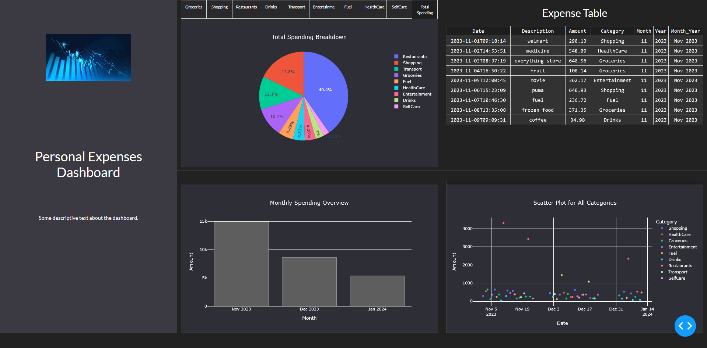
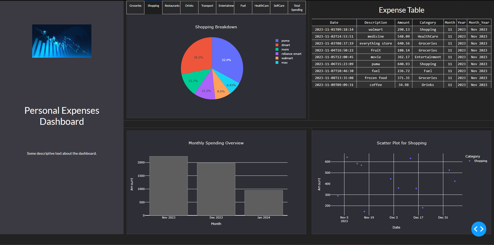

# Personal Expenses Dashboard

## Description:

- The Personal Expenses Dashboard is a web-based application built using Python, Dash, and Plotly, designed to help users visualize their personal expenses. It categorizes spending data from Google Sheets and provides various charts for a detailed analysis of expenditures.    
- The purpose of this application is to provide an interface for tracking and visualizing personal spending habits. By categorizing expenses and presenting the data in pie charts, bar charts, and scatter plots, users can gain insights into their spending patterns and make informed financial decisions.

## Why Dash And Plotly:

- Plotly is a data visualization library that allows to create interactive and visually appealing charts, graphs, and other visualizations in Python.
- Dash is a web application framework built on top of Plotly, specifically designed for building interactive, web-based data dashboards. It provides the structure and interactivity for your app, enabling you to combine Plotly visualizations with other elements like dropdowns, sliders, and data tables.
- So, while Plotly handles the creation of the visualizations, Dash is responsible for bringing those visualizations to life in a web-based, interactive environment. Together, they make a powerful tool for data visualization and interactive data exploration.
- Also, it is very easy of use,helps to create interactivity, and has a strong community support.

## Features:

1. **Expense Categorization:** Automatically categorize expenses based on keywords in descriptions.
2. **Interactive Charts:** Visualize data through pie charts, bar charts, and scatter plots.
3. **Responsive Design:** Built with Dash and Bootstrap for a responsive and visually appealing interface.
4. **Google Sheets Integration:** Load and process data directly from a Google Sheets document.
5. **Dynamic Filtering:** Allows users to filter and view expenses by category, date range, or specific keywords, enabling detailed analysis and insights.
6. **Real-Time Updates:** The data table is synchronized with the visualizations, ensuring that any updates or filters applied to the data are immediately reflected in the table.

## Screenshots:

## How Does This Work? (Project WorkFlow)

### Data Loading and Preparation:(Google Sheets Integration)
- Used Google Sheet Integration using "gspread library"  (For Instructions about how to create your own API so that you can analyse your own data by accessing your own google sheet from your google drive please scroll to the last point of this document).
- The Application starts by connecting to google sheets (using gspread). The connection is authenticated via service account JSON file.
Later the data is retrieved from a specific worksheet in the google sheets file and is converted into pandas dataframe.

### Data Transformation:
1. **Column Selection & Renaming:** The application selects the specifice columns/narrows down into the columns that are neccessary for analysing the data and the neccessary columns are renamed for keeping consistency in the project.
2. **Text Normalization:** Neccessary columns are converted to lowercase (in this case Description) to ensuring uniformity, helping in easier catgorization.
3. **Categorization:** The expenses are categorized based on keywords found in the Description column. Categories include Groceries, Shopping, Restaurants, Drinks, Transport, Entertainment, Fuel, HealthCare, and SelfCare.(If analaysing your own document do not forget to mention which keywords you used in the description column should be assigned what category in the main file )
4. **Date Processing:** The Date column is converted to datetime format, and new columns (Month, Year, Month_Year) are added to capture the month, year, and a formatted month-year string.

### Data Saving:
The processed DataFrame is saved to a CSV file (personal_expenses_sorted.csv) for future reference.

### Data Visualization With Dash:
1. **Dash Application Setup:** The application is created using the Dash framework, with a Bootstrap theme (DARKLY) for styling.
2. **layout:** The layout is divided into two main sections:
    1. **Sidebar:** Contains a logo, title, and descriptive text.
    2. **Main Content Area:** 
        - Contains tabs for selecting different categories (Groceries, Shopping, Restaurants, etc.).
        - Displays three types of visualizations: a pie chart, a bar chart, and a scatter plot.
        -  The table showing all expense data.
3. **Visualization Functions:**
    - **Pie Chart:** Displays the breakdown of spending based on the selected category. If "Total" is selected, it shows the overall spending breakdown across all categories.
    - **Bar Chart:** Shows monthly spending trends. If a category is selected, the bar chart focuses on that category's spending over time.
    - **Scatter Plot:** Visualizes the spending amounts over time, colored by category.

(NOTE: Dash's callback system is used to update the visualizations (pie chart, bar chart, and scatter plot) dynamically based on the user's selection from the tabs.) 

## Application Execution

The application is run on a local server with debugging enabled. It is responsive and allows users to interact with the data by selecting different categories, which updates the displayed charts and tables.

## Overall Summary

1. **Data Flow:** 
    - Data is pulled from Google Sheets, transformed, and categorized.
    - The processed data is then used to generate different types of visualizations.
    -  Users interact with the dashboard through tabs, which dynamically updates the charts and table based on the selected category.

2. **Interaction and User Experience:** Users can explore their spending habits by selecting different expense categories. The app provides immediate feedback through the updated visualizations, offering insights into where their money is going.
3. **Immediate Update From Sheets:** If data is added deleted or altered on the google sheets on refresh it will be instantly reflected on the dashboard.

## How to Generate Your Own API
1. **Google Sheets API Setup:**
   - Go to the Google Cloud Console.
   - Create a new project and enable the Google Sheets API.
   - Create service account credentials and download the JSON file. Save this file as `personal_expenses.json`.

2. **Set Up Google Sheets:**
   - Create a Google Sheets document named `personal_expenses`.
   - Ensure the sheet contains columns named `Completion_Date`, `Description`, and `Amount`.
   - Share the sheet with the service account email from the JSON file.

## Running the Application:
- Clone the repository and navigate to the project directory.
- Install the required dependencies using pip install -r requirements.txt.
- Place the personal_expenses.json file in the root directory of the project.
- Run the application with python app.py.
- Access the dashboard by navigating to http://127.0.0.1:8050/ in your browser.

(Please Install requirments.txt which contains all the packages used in the above program)
